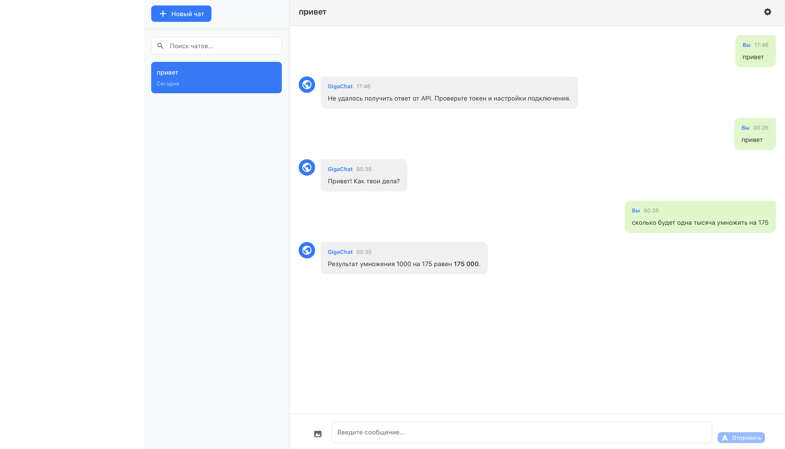
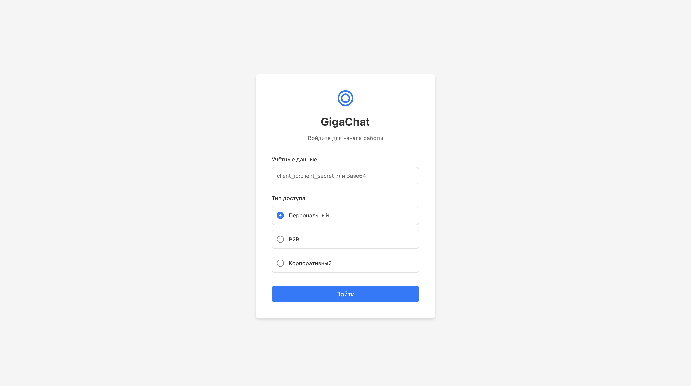

# GigaChat Client

Веб-приложение для общения с GigaChat API, реализованное на React + TypeScript.

## Демо




## Функциональность

- 💬 Чат с GigaChat AI в режиме реального времени (streaming)
- 📝 Markdown-форматирование ответов с подсветкой кода
- 🖼️ Отправка изображений (multimodal)
- 💾 История чатов сохраняется в localStorage
- 🔍 Поиск по чатам
- ✏️ Создание, переименование и удаление чатов
- ⚙️ Настройки модели (temperature, top-p, max tokens)
- 🌙 Светлая и тёмная тема
- ⏹️ Остановка генерации

## Стек технологий

- React 18 + TypeScript
- Context API + useReducer
- CSS Modules
- react-markdown + rehype-highlight
- Fetch API + SSE (streaming)

## Установка и запуск

### 1. Клонируй репозиторий

```bash
git clone https://github.com/твой-username/gigachat_client.git
cd gigachat_client
```

### 2. Установи зависимости

```bash
npm install
```

### 3. Настрой переменные окружения

Скопируй `.env.example` в `.env`:

```bash
cp .env.example .env
```

Оставь `.env` пустым — в режиме разработки используется встроенный прокси.

### 4. Запусти приложение

```bash
npm start
```

Открой [http://localhost:3000](http://localhost:3000)

## Получение учётных данных GigaChat

1. Зарегистрируйся на [developers.sber.ru/studio](https://developers.sber.ru/studio)
2. Создай проект и подключи GigaChat API
3. Скопируй `client_id` и `client_secret`
4. На странице входа введи строку `client_id:client_secret`
5. Выбери scope **Персональный**
6. Нажми **Войти**
